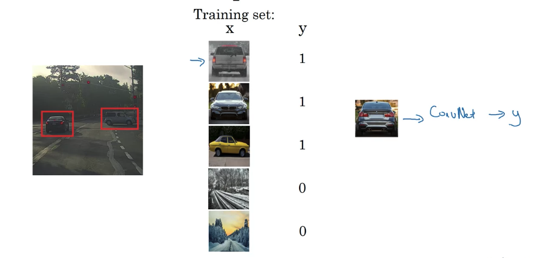

# Object Detection

## Training a typical classifier with near the edge cropping

### Then perform sliding windows detection


**Computationally costly!**


## Convolutional Implementation of Sliding Windows

