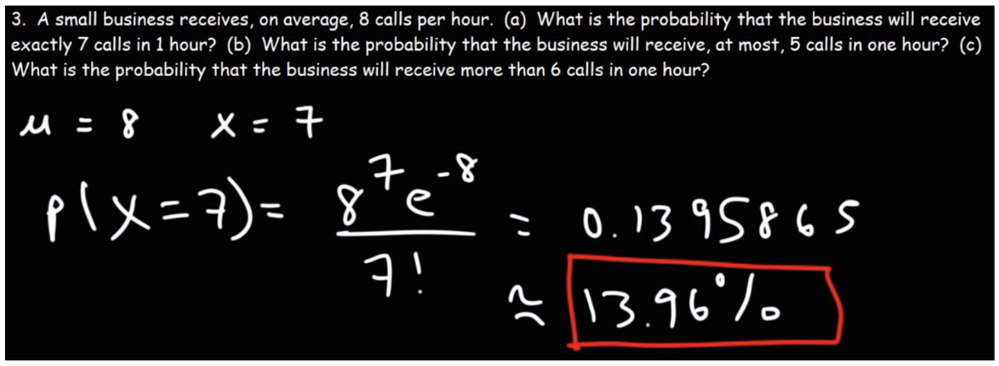
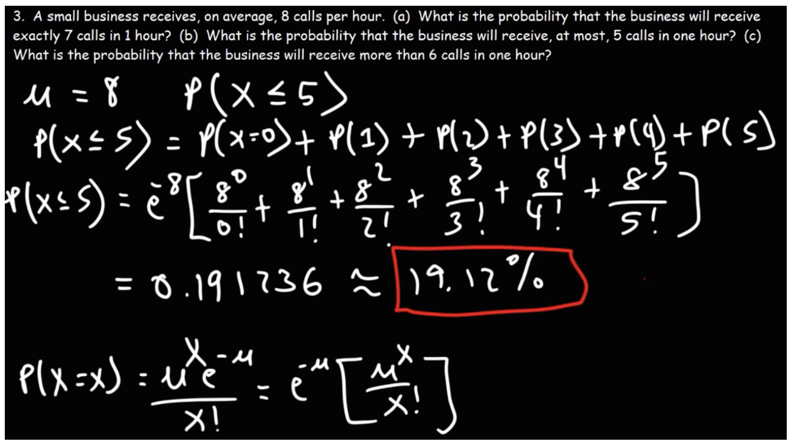

# Poisson Distribution


It is a discrete distribution function describing the probability that an event will occur a certain number of times in a fixed time (or space) interval.


It is used to model count-based data, like the number of emails arriving in your mailbox in one hour or the number of customers walking into a shop in one day, for instance. It can be used to predict how many times an event might occur in a given time period.&#x20;

* The number (k) of hits on a website in one hour with an average hit rate of 6 hits per hour is poisson distributed.
* Insurance companies to conduct risk analysis (eg. predict the number of car crash accidents within a predefined time span) to decide car insurance pricing.

**The Poisson distribution is parametrized by the expected number of events λ** (pronounced “lambda”) in a time or space window. The distribution is a function that takes the **number of occurrences of the event as input** (the integer called k in the next formula) and **outputs the corresponding probability** (the probability that there are k events occurring).

### The Probability Mass Function

$$
P(k;\lambda) = \frac{\lambda^k e^{-\lambda}}{k!}
$$

for k = 0, 1, 2, ...\
The formula of P(k; λ) returns the probability of observing k events given the parameter λ which corresponds to the expected (sometimes called average) number of occurrences in that time slot.


**Poisson Process:** The timing of the next event is completely independent of when the previous event happened.


### Example


Say we do a Bernoulli trial every minute for an hour, each with a success probability of 0.1. We would do 60 trials, and the number of successes is Binomially distributed, and we would expect to get about 6 successes. This is just like the Poisson story we discussed, where we get on average 6 hits on a website per hour.&#x20;

So, the Poisson distribution with arrival rate equal to **np** approximates a Binomial distribution for **n** Bernoulli trials with probability **p** of success (with **n** large and **p** small). Importantly, the Poisson distribution is often simpler to work with because it has only one parameter instead of two for the Binomial distribution.






