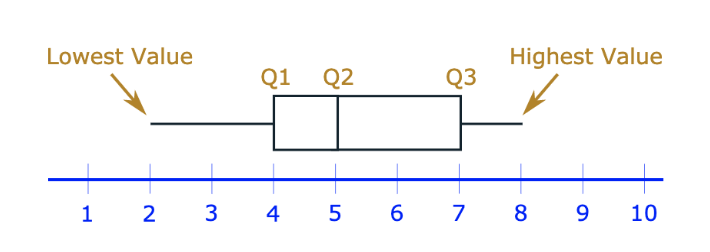
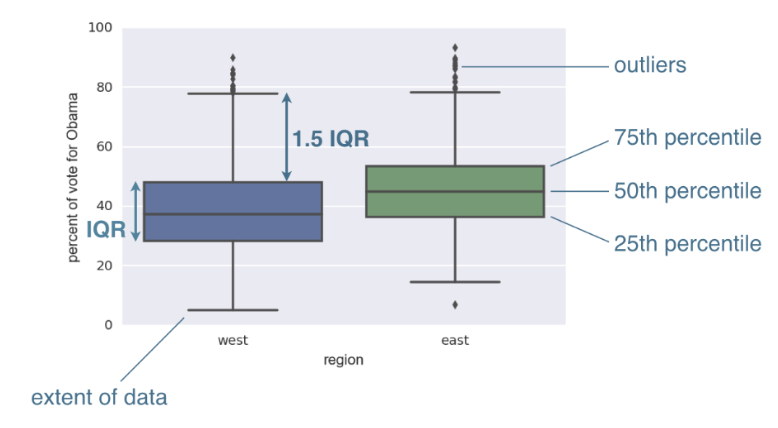

# Box and Whisker Plots


Box plot is a tool to visually represent the range, interquartile range, median, mode, outliers, and all quartiles.


### Outliers in Box and Whisker Plots

The standard definition for an outlier is **the number which is less than Q1 or greater than Q3 by more than 1.5 times the interquartile range** \( IQR=Q3−Q1 \).

