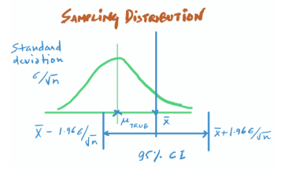

# Confidence Interval


Confidence level represents the probability that the unknown parameter lies in the stated interval. The level of confidence can be chosen by the investigator.


This proposes a range of plausible values for an unknown parameter. The interval has an associated confidence level that the true parameter is in the proposed range.


Imagine you want to find the mean height of all the people in a particular US state. You could go to each person in that particular state and ask for their height, or you can do the smarter thing by taking a sample of 1000 people in the state. 


Then you can use the mean of their heights \(Estimated Mean\) to estimate the average heights in the state \(True Mean\).

### Calculating Confidence Interval

We cast a net from the value we know $$\overline{x}$$ .

To get such ranges or intervals, we go `1.96 SD` away from $$\overline{x}$$ \(the sample mean\) in both directions. And this range is the `95%` confidence interval.

Now, when we say that, we estimate the true mean to be $$\overline{x}$$ \(the sample mean\) with a confidence interval of \[ $$\overline{x}-1.96\sigma, \overline{x}+1.96\sigma$$ \], we are literally saying that: It is with `95%` probability that the true population mean is within these Confidence Interval limits.

> When you take 99% CI, you essentially increase the proportion and thus cast a wider net with three standard deviations.

$$
\overline{x} \pm z \frac{s}{\sqrt{n}}
$$

Here, $$\overline{x}$$  is the sample mean \(mean of the 1000 heights sample we took\). $$z$$ is the no. of standard deviations away from the sample mean \(1.96 for 95%, 2.576 for 99%\), level of confidence we want. $$s$$ is the standard deviation in the sample. $$n$$ is the size of the sample.

### References



