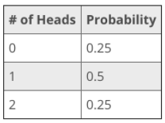

# Random Variable


A random variable is a variable that is subject to randomness, which means it can take on different values.


* In statistics, it is normal to use an `X` to denote a random variable.&#x20;
* The random variable takes on different values depending on the situation.
* Each value of the random variable has a probability or percentage associated with it.

### Discrete Random Variables

A discrete random variable is a variable that represents numbers found by counting. For example, number of marbles in a jar, number of students present or number of heads when tossing two coins.


X is discrete because the numbers that X represents are isolated points on the number line.


The number of heads that can come up when tossing two coins is a discrete random variable because heads can only come up a certain number of times: 0, 1, or 2. Also, we want to know the probability associated with each value of the random values.

A probability distribution has all the possible values of the random variable and the associated probabilities.&#x20;

### Continuous Random Variables


When we have to use intervals for our random variable or all values in an interval are possible, we call it a continuous random variable.


Thus, continuous random variables are random variables that are found from measuring - like the height of a group of people or distance traveled while grocery shopping or student test scores.


In this case, X is continuous because X represents an infinite number of values on the number line.


Like the coin example, the random variable (in this case, the intervals) would have certain probabilities or percentages associated with it. And this would be a probability distribution for the test scores.

In the study of probability, we are interested in finding the probabilities associated with each value of these random variables.

**Sum of Probabilities for a Distribution**\
On the above, in each table, the sum of all probabilities add up to 1 or 100%. However, for continuous random variables, we can construct a histogram of the table with relative frequencies, and the area under the histogram is also equal to 1.

