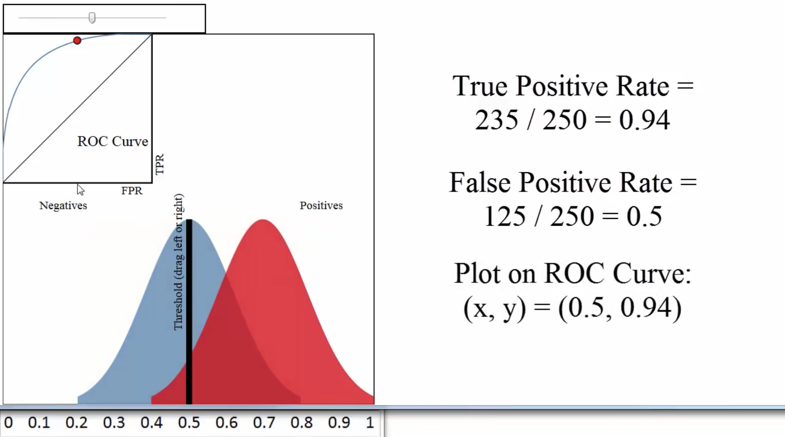

# ROC and AUC


**ROC Curve** Is the plot of Sensitivity/TPR \(Y axis\) vs \(1-Specificity\)/FPR \(X axis\). It is a graphical plot that illustrates the diagnostic ability of a binary classifier, as its **discrimination threshold is varied**. 



AUC is a metric for how well a model fit the data \(1 being absolutely perfect fit\).




