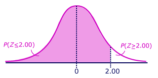

# Statistical Significance


If the observed p-value is less than alpha \(a threshold which is usually 0.05 or 5%\), then the results are statistically significant.


Whether or not the result can be called statistically significant depends on the p-value \(known as alpha\), we establish for significance before we begin the experiment.

Statistical significance is built on a few simple ideas: **hypothesis testing, the normal distribution, and p values**. 

**If the observed p-value is less than alpha, then the results are statistically significant.** We need to choose alpha before the experiment because if we waited until after, we could just select a number that proves our results are significant no matter what the data shows!

> The choice of alpha depends on the situation and the field of study, but the most commonly used value is 0.05, corresponding to a 5% chance the results occurred at random.

### From Z-score to P-value

To get from a z-score on the normal distribution to a p-value, we can use a table or any statistical software. The result will show us the probability of a z-score lower than the calculated value. For example, with a z-score of 2, the p-value is 0.977, which means there is only a 2.3% probability we observe a z-score higher than 2 at random \(because of random noise\).

> **Note: In the above example, we are considering all of the left side up to 2 SD to the right side of the mean. Hence, its 50+34.1+13.6 = 97.7**


An example statement - There is statistically significant evidence our students get less sleep on average than college students in the US at a significance level of 0.05. The p-value shows, there is a 2.12% chance that our results occurred because of random noise.




