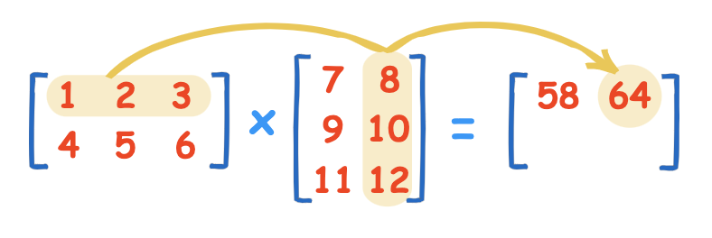
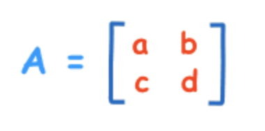

# Matrix

### Multiplying a Matrix by Another Matrix

Need to do the "dot product" of rows and columns.

## Dividing a Matrix by Another Matrix

We don't do that. Rather we make the inverse of the denominator matrix and then multiply it with the numerator matrix.

## Inverse of a Matrix

**2x2 Matrix.** The inverse of a 2x2 is easy compared to larger matrices \(such as a 3x3, 4x4, etc\). For those larger matrices there are other methods to work out the inverse.

Very much helpful if we want to get an unknown matrix such as X where,$$XA = B$$ by $$X = BA^{-1}$$ 

## Determinant of a Matrix

The determinant of a matrix is a special number that can be calculated from a square matrix. The determinant helps us find the inverse of a matrix, tells us things about the matrix that are useful in systems of linear equations, calculus and more.

**Calculating the Determinant - For a 2×2 Matrix**

$$
|A| = ad - bc
$$

## Identity Matrix

It is the matrix equivalent of the number "1". It is "square" \(has same number of rows as columns\), It has 1s on the diagonal and 0s everywhere else.





