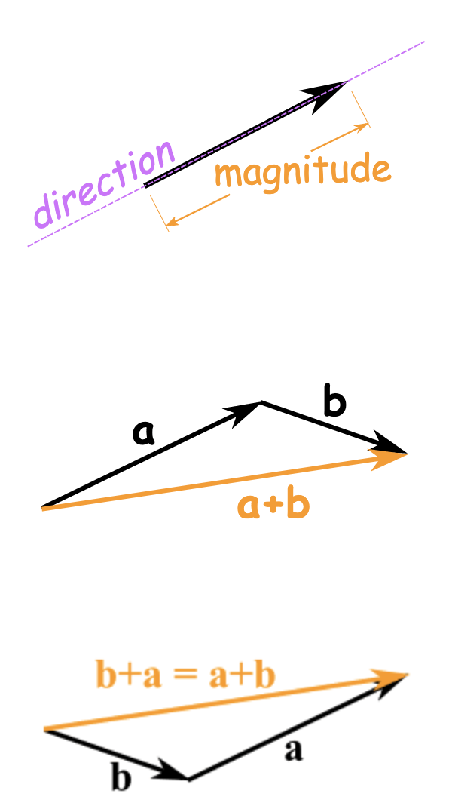

# Scaler vs Vector

A vector has a magnitude and direction. The length of the line shows its magnitude and the arrowhead points in the direction. We can add two vectors by joining them head-to-tail. And it doesn't matter which order we add them, we get the same result.

